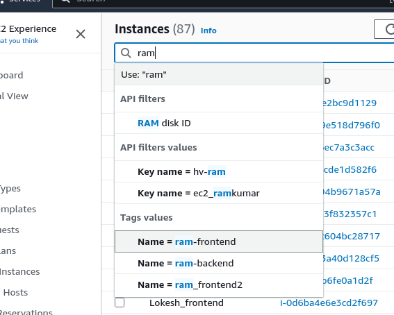

# Deployment Documentation

This document provides step-by-step instructions for deploying a web application with two frontend instances and one backend instance. The deployment includes setting up GitHub, configuring MongoDB, Nginx as a reverse proxy, and using Cloudflare for domain management.

## Step 1: Create Instances

Create three instances: two for frontend and one for backend.

## Step 2: Clone Repository

Connect to GitHub and clone the repository on all three instances.

## Step 3: Configure Backend

In the backend instance, open the `.env` file and configure the MongoDB database with the credentials for the previously created free cluster. Also, configure the ports for the backend.

## Step 4: Configure Nginx as Reverse Proxy

Configure Nginx as a reverse proxy by following [this documentation](https://techieadarsh.hashnode.dev/how-to-set-up-a-reverse-proxy-for-nginx-step-by-step). Ensure you unlink the default configuration files and link the new configuration files.

## Step 5: Configure Frontend

On the frontend instances, edit the `url.js` file and specify the backend IP address.

## Step 6: Domain Purchase

A domain name, `dynalink.in`, was purchased from Hostinger.

## Step 7: Configure Cloudflare

Configure Cloudflare to function as an entrance for the domain. Set up the necessary DNS settings, including A records for frontend and backend, and CNAME for load balancer.

## Step 8: Create Target Group and Load Balancer

Create a Target Group for frontend instances and specify the necessary security group settings. Create a load balancer using the target group.

## Step 9: Start Frontends

Start the frontend instances using the command: `sudo node index.js`.

## Step 10: Start Backend

Start the backend instance using the command: `sudo npm start`.

## Step 11: Verify Application

After the application is successfully started, access it by navigating to the DNS (e.g., `dynalink.in`) in a web browser. Add experiences, complete all fields, and save. The entries should appear on the screen and reflect in the database (verify on Atlas).

